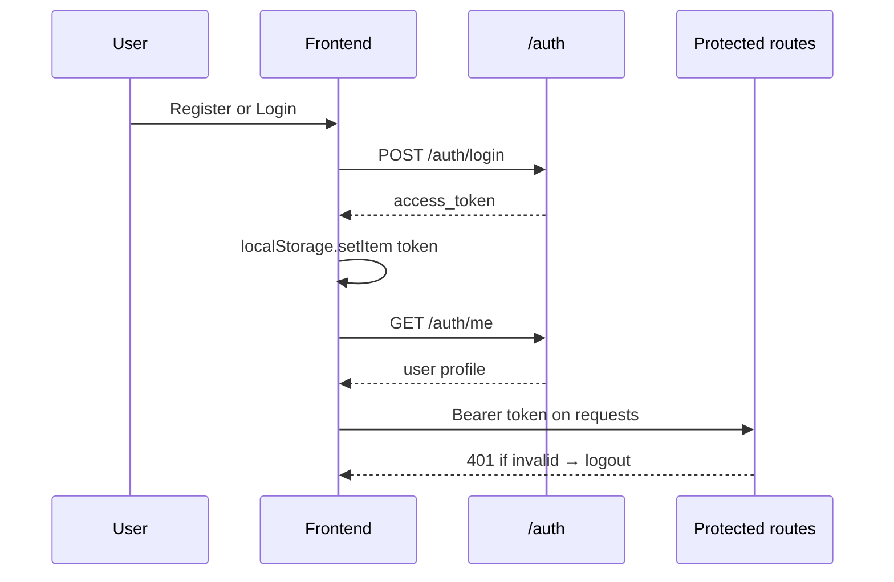

# Architecture

## System overview

```mermaid
flowchart TB
    subgraph client [Browser]
        App[App.jsx]
        Catalog[CatalogView]
        Library[LibraryView]
        App --> Catalog
        App --> Library
    end

    subgraph api [FastAPI backend]
        AuthR[/auth]
        BooksR[/books + /recommend]
        UsersR[/user]
        RatingsR[/ratings]
        RecSvc[recommender.py]
        HFSvc[hf_recommender.py]
        BooksR --> RecSvc
        BooksR --> HFSvc
        UsersR --> RecSvc
    end

    subgraph data [External]
        Mongo[(MongoDB library_db)]
        HF[HuggingFace API]
    end

    client -->|JWT Bearer| api
    api --> Mongo
    HFSvc --> HF
```

## Auth lifecycle



- Passwords hashed with **pbkdf2_sha256** (passlib), not bcrypt.
- JWT expiry: **30 days** (`backend/app/core/auth.py`).
- Token stored in `localStorage` as `token`.

## Data split: catalog vs library

| Store | Collection | Who sees it | Recommender |
|-------|------------|-------------|-------------|
| Global catalog | `books` | All users (via API; UI requires login) | Global TF-IDF model |
| Personal library | `user_books` | Owner only | Per-user TF-IDF model |
| Ratings | `ratings` | Aggregates public; per-user ratings private | Not used in ML yet (Phase 2) |

When a user **collects** a catalog book, the full book document is **copied** into `user_books` (denormalized). Catalog updates do not propagate.

Custom books (`POST /user/add-custom-book`) go only to `user_books`, never to `books`.

## Startup sequence

1. `validate_runtime_config()` — requires `JWT_SECRET` or `SECRET_KEY`
2. FastAPI `lifespan` starts daemon thread → `train_recommender_on_startup()`
3. Thread loads all `books` from MongoDB → `train_model()` → in-memory global model
4. `GET /health` reports `recommender_ready: true` when `_books_df` is set

Per-user models train on first recommend or when library changes (add/delete book).

## Frontend navigation

No URL router — tab state in `App.jsx` (`view`: `"catalog"` | `"library"`).

- Unauthenticated → `Login` or `Register`
- Missing `VITE_API_BASE_URL` → configuration screen
- Authenticated → header + tabs + `CatalogView` or `LibraryView`

## Deployment topology

| Layer | Host | Notes |
|-------|------|-------|
| Frontend | Vercel | SPA rewrite in `vercel.json` |
| Backend | Render / Railway | `backend/Procfile`, single worker |
| Database | MongoDB Atlas | `library_db` |
| AI | HuggingFace Inference | Optional `HF_API_KEY` |

See [DEPLOYMENT.md](DEPLOYMENT.md).
