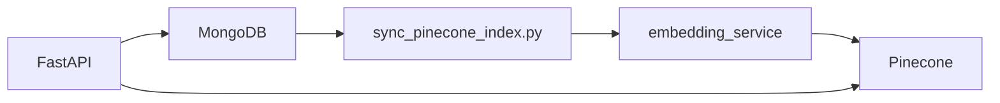

# Machine learning & recommendations

## Overview

Three recommendation paths:

1. **Global catalog** — sentence embeddings in **Pinecone** + ANN query + hybrid re-rank
2. **User library** — per-user Pinecone namespace on `user_books`
3. **AI assistant** — HuggingFace Llama-3 via chat completions (natural language → 3 book JSON)

Ratings are used in **hybrid scoring**: `0.7 * cosine + 0.3 * normalized_rating`.

MongoDB remains the source of truth for catalog, library, and ratings. Pinecone stores vectors only.

---

## Architecture



- **Index sync** (local/CI): `scripts/sync_pinecone_index.py` encodes `title + description` with `all-MiniLM-L6-v2` (384-dim) and upserts to Pinecone
- **API hot path**: in-memory vector cache → Pinecone query → hybrid re-rank with cached ratings → hydrate book metadata from MongoDB
- **Production Render**: set `SKIP_EMBEDDING_SYNC=true`; run sync script separately (no torch on API server)

Namespaces: `catalog` (global), `user_{user_id}` (private library).

### Pinecone in-process caching

`pinecone_store.py` caches namespace readiness, vector counts, and seed vectors after sync/upsert. This avoids `describe_index_stats()` and `fetch()` on every `/recommend` request (~300 ms vs ~700 ms before caching).

When the cache is cold (new process), `get_namespace_vector_count()` falls back to one Pinecone stats call via `warm_namespace_cache()` — used by `/health` and CI verify steps.

---

## Catalog data sources

| File / source | Books | How |
|---------------|-------|-----|
| `library_db.books.1000.json` | 1,000 | Goodreads **goodbooks-10k** subset via `csv_to_books_json.py` |
| `library_db.books.json` | ~50 | Small dev seed |
| `library_db.books.goodreads.json` | ~9,778 | Generated at runtime by `fetch_goodreads_catalog.py` (not committed) |

**goodbooks-10k** CSV: https://github.com/zygmuntz/goodbooks-10k  
Convert locally: `python scripts/csv_to_books_json.py --csv books.csv --limit 1000`

---

## Evaluation & benchmark toolkit

Metrics: `Precision@k`, `Recall@k`, `HitRate@k`, `MRR@k`, latency `mean/p50/p95`.

### Manual (local)

```bash
cd backend
pip install -r requirements.txt -r requirements-embeddings.txt
python scripts/sync_pinecone_index.py --scope catalog
python scripts/calc_recommender_stats.py --labels eval/relevance_labels.example.json --k 5 --runs 20
python scripts/benchmark_api_latency.py --labels eval/relevance_labels.example.json --wait-health
```

Use `--skip-train` on `calc_recommender_stats.py` after a sync step to avoid re-encoding.

Offline eval (no Pinecone account):

```bash
python scripts/calc_recommender_stats.py --labels eval/relevance_labels.example.json --books-file ../library_db.books.json --offline
```

### Full ~9.8k pipeline (GitHub Actions — recommended)

Workflow: **Actions → Catalog benchmark (~9.8k Goodreads) → Run workflow**

Runs `run_catalog_benchmark.py` which:
1. Downloads goodbooks-10k → ~9,778 unique English titles
2. Seeds MongoDB + syncs Pinecone
3. Benchmarks in-process and API latency
4. Uploads `benchmark_report.json` / `.md` with **per-step timing bars** and CI duration estimates

**Estimated CI time:** ~15–18 min cold, ~12–15 min with warm HuggingFace cache. See report artifact for actuals.

### Scripts reference

| Script | Purpose |
|--------|---------|
| `fetch_goodreads_catalog.py` | Download goodbooks-10k CSV → `library_db.books.goodreads.json` |
| `csv_to_books_json.py` | Convert Goodreads CSV to seed JSON (`--limit 0` = all unique English) |
| `seed_catalog.py` | Import JSON into MongoDB |
| `sync_pinecone_index.py` | Encode + upsert vectors to Pinecone |
| `calc_recommender_stats.py` | Quality + in-process latency (`--skip-train` after sync) |
| `benchmark_api_latency.py` | End-to-end `GET /recommend/{id}` latency |
| `run_catalog_benchmark.py` | Orchestrates fetch → seed → sync → benchmarks + reports |

---

## Key modules

| Module | Role |
|--------|------|
| `app/services/embedding_service.py` | HF encoder (sync time only) |
| `app/services/pinecone_store.py` | Pinecone upsert/query + in-memory caches |
| `app/services/vector_sync.py` | Mongo books → Pinecone vectors |
| `app/services/vector_recommender.py` | Query + hybrid re-rank |
| `app/services/recommender.py` | Public facade for routes |

### Train / sync triggers

- Startup: cache ratings + optional catalog sync (unless `SKIP_EMBEDDING_SYNC`)
- `POST /train` (admin): full catalog re-sync
- `POST /books` (admin): upsert single book vector
- User library add/remove: re-sync `user_{id}` namespace
- GitHub Actions: see [DEPLOY.md](../DEPLOY.md)

---

## Environment

```env
PINECONE_API_KEY=
PINECONE_INDEX_NAME=libra-books
EMBEDDING_MODEL=sentence-transformers/all-MiniLM-L6-v2
SKIP_EMBEDDING_SYNC=true          # production API
```

Create Pinecone index: **384 dimensions**, **cosine** metric.

---

## AI suggestions (`hf_recommender.py`)

Unchanged — uses `HF_API_KEY` for Llama-3 chat completions, separate from embedding retrieval.
