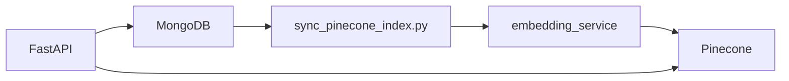

# Machine learning & recommendations

## Overview

Three recommendation paths:

1. **Global catalog** — sentence embeddings in **Pinecone** + ANN query + hybrid re-rank
2. **User library** — per-user Pinecone namespace on `user_books`
3. **AI assistant** — HuggingFace Llama-3 via chat completions (natural language → 3 book JSON)

Ratings are used in **hybrid scoring**: `0.7 * cosine + 0.3 * normalized_rating`.

MongoDB remains the source of truth for catalog, library, and ratings. Pinecone stores vectors only.

---

## Architecture



- **Index sync** (local/CI): `scripts/sync_pinecone_index.py` encodes `title + description` with `all-MiniLM-L6-v2` (384-dim) and upserts to Pinecone
- **API hot path**: fetch seed vector → Pinecone query → hybrid re-rank with cached ratings → hydrate book metadata from MongoDB
- **Production Render**: set `SKIP_EMBEDDING_SYNC=true`; run sync script separately (no torch on API server)

Namespaces: `catalog` (global), `user_{user_id}` (private library).

---

## Evaluation & benchmark toolkit

Metrics: `Precision@k`, `Recall@k`, `HitRate@k`, `MRR@k`, latency `mean/p50/p95`.

```bash
cd backend
pip install -r requirements-embeddings.txt   # for encoding during sync/eval
python scripts/sync_pinecone_index.py --scope catalog
python scripts/calc_recommender_stats.py --labels eval/relevance_labels.example.json --k 5 --runs 20
python scripts/benchmark_api_latency.py --labels eval/relevance_labels.example.json --wait-health
```

Offline eval (no Pinecone account):

```bash
python scripts/calc_recommender_stats.py --labels eval/relevance_labels.example.json --books-file ../library_db.books.json --offline
```

---

## Key modules

| Module | Role |
|--------|------|
| `app/services/embedding_service.py` | HF encoder (sync time only) |
| `app/services/pinecone_store.py` | Pinecone upsert/query/fetch |
| `app/services/vector_sync.py` | Mongo books → Pinecone vectors |
| `app/services/vector_recommender.py` | Query + hybrid re-rank |
| `app/services/recommender.py` | Public facade for routes |

### Train / sync triggers

- Startup: cache ratings + optional catalog sync (unless `SKIP_EMBEDDING_SYNC`)
- `POST /train` (admin): full catalog re-sync
- `POST /books` (admin): upsert single book vector
- User library add/remove: re-sync `user_{id}` namespace

---

## Environment

```env
PINECONE_API_KEY=
PINECONE_INDEX_NAME=libra-books
EMBEDDING_MODEL=sentence-transformers/all-MiniLM-L6-v2
SKIP_EMBEDDING_SYNC=true          # production API
```

Create Pinecone index: **384 dimensions**, **cosine** metric.

---

## AI suggestions (`hf_recommender.py`)

Unchanged — uses `HF_API_KEY` for Llama-3 chat completions, separate from embedding retrieval.
